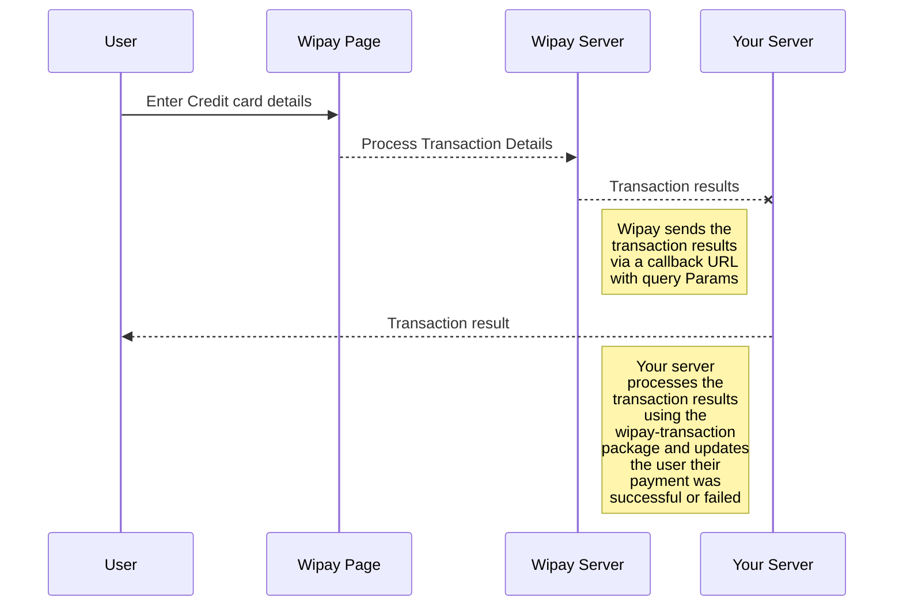

# Wipay Transaction

A JS package for handling a wipay transaction on the server.

# Installation

## Prerequisties
* node.js version 10+
* Wipay Developer Account [Sign Up]([https://wipaycaribbean.com/sign-up/](https://wipaycaribbean.com/sign-up/))

## Environment Variables

Do not hardcode your merchant Key.  Use environment variables or some secure secrets manager like AWS secrets manager. For example:

```bash
echo  "MERCHANT_KEY=YOUR_MERCHANT_KEY"  > wipay.env
echo wipay.env >> .gitignore
source ./wipay.env
```
## Install the Package
```bash
npm i wipay-transaction
```

## Quick Start Example Code

```javascript 
const WipayTransaction = require('wipay-transaction');

//The query params should come from your request object at req.query.
let queryParams = {
		status: "success", 
		name: "John Doe",
		email: "customer@gmail.com" ,
		hash: "c53db9c12c17a3d3e0f4fc6b790e4fcd", 
		order_id: "4398", 
		transaction_id: "100-1-4398-20170108100202", 
		reasonCode: "1", 
		reasonDescription: "Transaction is approved.", 
		responseCode: "1", 
		total: 10, 
		D: "TTD"
}

// Contstruct a new transaction
let wipayTransaction =  new WipayTransaction(queryParams);

if(!wipayTransaction.isSuccessful) res.send("Transaction failed")

// verify the hash sent by wipay,here we used the sandbox key, 123 
wipayTransaction.verifyHash(process.env.MERCHANT_KEY) ? res.send("Transaction Successful") : res.send("Transaction failed")transaction
```

## WipayTransaction Properties
```javascript 
{
	status: 'string',
	name: 'string',
	email: 'string',
	hash: 'string',
	orderId: 'string',
	transactionId: 'string',
	reasonCode: 'int', 
	reasonDescription: 'string', 
	responseCode: 'int', 
	total: 'int', 
	currency: 'string',
	isSuccessful: 'boolean',
	verifyHash: (merchant_key) => 'boolean'
}
```

## UML diagrams
Typical flow of using wipay on your website

## Contributing
Pull requests are welcome. For major changes, please open an issue first to discuss what you would like to change.

Please make sure to update tests as appropriate.

## License
[MIT](https://choosealicense.com/licenses/mit/)
